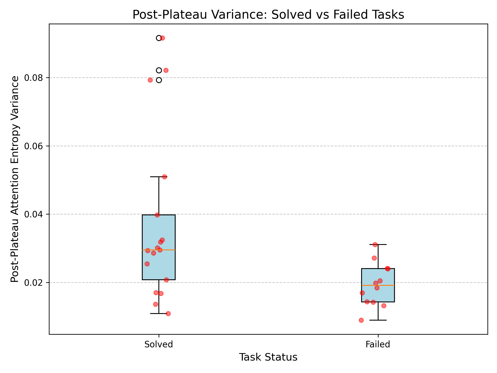

# Within-Context Attention Phase Transition Analyzer

A hypothesis-testing pipeline for one question: **does a frozen transformer's attention
behave measurably differently, within a single forward pass, when it solves a task versus
when it fails one?**

It generates matched synthetic tasks, runs them through a HuggingFace causal LM, extracts
attention-derived metrics per token position, and runs a Bonferroni-corrected statistical
test comparing solved vs. failed instances.

## Headline result (GPT-2 small, Phase C1)

Across 30 task instances (5 seeds × 6 task types), one of three tested metrics separates
solved from failed tasks after correction:

| Metric | n(solved) | n(failed) | mean(solved) | mean(failed) | p (corrected) | effect size r | Result |
|---|---|---|---|---|---|---|---|
| **post_plateau_var** | 17 | 12 | 0.0371 | 0.0194 | **0.042** | **-0.549** | Solved > failed |
| plateau_onset_fraction | 17 | 13 | 0.4062 | 0.4738 | 1.000 | 0.186 | No effect |
| entropy_rise_rate | 17 | 13 | 0.0096 | 0.0106 | 1.000 | 0.140 | No effect |

**Reading it:** solved tasks show higher post-plateau attention-entropy variance than failed
ones — attention stays dynamic rather than settling into a quieter state. One plausible
reading is sustained retrieval/pattern-matching circuits rather than a static "locked-in"
state once the answer is found. The other two metrics show no significant effect; that's
reported honestly rather than dropped.



Full narrative — the original confounded finding, two methodology bugs, and a stats bug that
initially reported this result's direction backwards — is in [`docs/FINDINGS.md`](docs/FINDINGS.md).

## Why this result should be trusted

- Bonferroni-corrected across all 3 tested metrics, not a single lucky comparison. The same
  correction discarded an earlier false positive at layer 10 in a full layer sweep (1 of 24
  comparisons).
- Effect size (rank-biserial r = -0.549) reported alongside p — medium-to-large, not
  borderline.
- Raw per-task values hand-verified against the printed table before trusting the result
  (see FINDINGS.md, Bug #3).
- 5 seeded instances per task type, not a single-run anecdote.

## Install

```bash
git clone https://github.com/Tarun995/Within-Context-Attention-Phase-Transition-Analyzer
cd Within-Context-Attention-Phase-Transition-Analyzer
pip install -e .
```

## Quickstart

```bash
attn-phase run --config configs/phase_c1.yaml
```

Loads GPT-2, builds 30 tasks across 6 task types (5 seeded instances each), runs the forward
passes, computes attention-derived metrics, and saves a curves plot plus a results JSON to
`results/`. Prints the Mann-Whitney U table shown above.

## Different model or tasks

```bash
attn-phase run --model gpt2-medium --layers 0-12 --seeds 5 --tasks all
```

Any HuggingFace causal LM name works. See `configs/phase_c1.yaml` for all configurable
fields (model, seed, target token length, layer range, task types).

## Repository structure

```
attention-phase-analyzer/
    pyproject.toml
    README.md
    LICENSE
    configs/
        phase_c1.yaml
    src/attn_phase/
        tasks.py          # synthetic task generation, multi-seed wrapper
        metrics.py         # attention entropy, plateau detection, oscillation metrics
        stats.py            # Mann-Whitney U + rank-biserial effect size + Bonferroni
        runner.py           # experiment orchestration
        layer_sweep.py       # multi-layer variant
        cli.py                # single command-line entry point
    tests/                     # 55+ tests: tasks, metrics, answer-matching, stats
    docs/
        FINDINGS.md              # full research narrative, including all bugs found
        historical_results/       # pre-deconfounding raw output, kept for traceability
    results/                        # generated at runtime, not tracked in git
```

## Testing

```bash
python -m pytest tests/ -v
```

55+ tests cover task generation, metric correctness on synthetic curves with known
properties, answer-matching regression cases, and statistical direction-labeling (added
after Bug #3 — see FINDINGS.md).

## Limitations

- Single model tested end-to-end (GPT-2 small, 117M); the CLI supports any HuggingFace
  causal LM, but larger-model results aren't reported yet.
- CPU-only run shown; not benchmarked for GPU throughput.
- One base seed (42) with 5 derived instances per task type — broader seed coverage is
  planned (see Future Work in FINDINGS.md).
- `mod_arith_m10_d1` appears in both the solved and failed groups across different seed
  instances — the reported separation is partly at the instance level, not purely between
  task types. See FINDINGS.md for detail.

## Related work

- Olsson et al. (2022) — "In-context Learning and Induction Heads"
- Vig (2019) — BertViz, a multiscale attention visualization tool
- Edelman et al. (2024) — "The Evolution of Statistical Induction Heads: In-Context Learning
  Markov Chains" (NeurIPS 2024)
- Todd et al. (2024) — "Function Vectors in Large Language Models" (ICLR 2024)

## License

MIT
