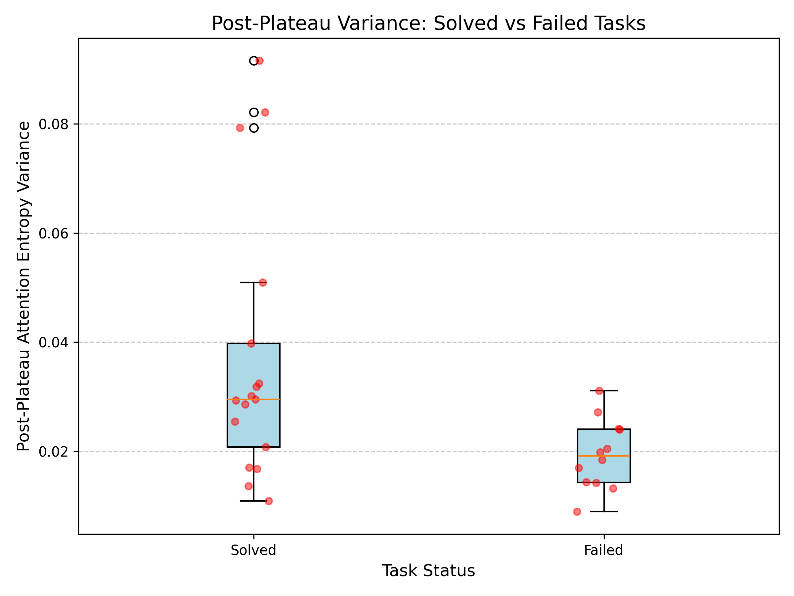
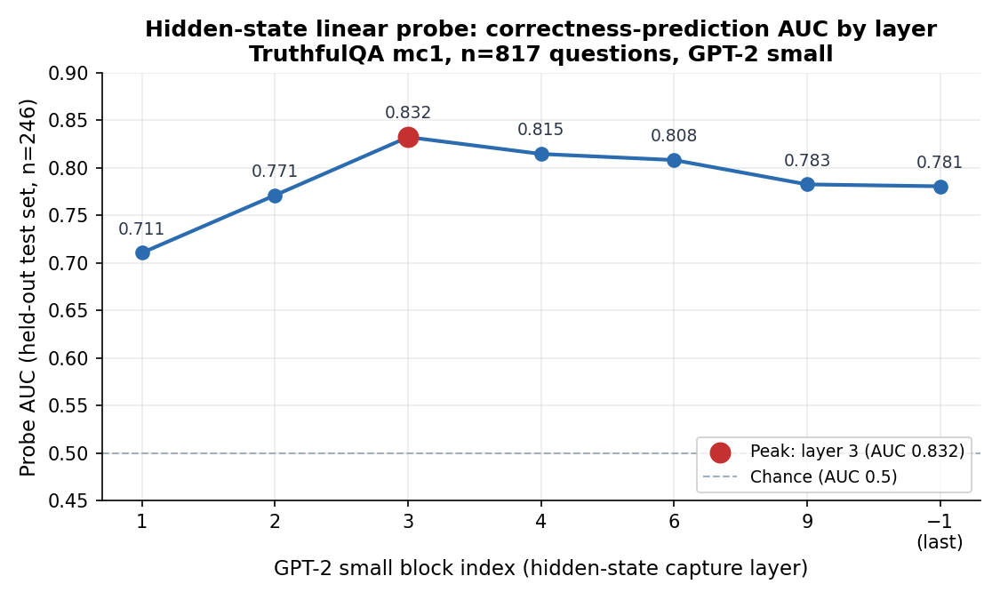

# Within-Context Attention Phase Transition Analyzer

**[Live dashboard →](https://within-context-attention-phase-tran.vercel.app/)** — interactive
view of the headline finding, the full research notebook (including the bugs found along the
way), and a panel for exploring your own `results.json` from a local run.

A statistical testing tool for a specific mechanistic-interpretability question: **does a
frozen transformer's attention behave measurably differently, within a single forward pass,
when it solves a task versus when it fails one — and if so, is that difference causal?**

This isn't a visualization tool — it's a hypothesis-testing pipeline. It generates matched
synthetic tasks, runs them through a HuggingFace causal LM, extracts attention-derived
metrics per token position, runs a properly powered, multiple-comparisons-corrected
statistical test comparing solved vs. failed task instances, and — as of Phase P1 —
causally tests the resulting correlation via activation patching.

## Research vision

The throughline across every phase of this project is one question: **when an internal
signal inside a language model correlates with whether it gets something right, is that
signal actually part of *why* it got it right — or just a symptom that happens to track the
outcome?** Almost all interpretability and LLM-confidence work stops at the correlation.
This project is built specifically to not stop there.

| Phase | Question asked | Method | Result |
|---|---|---|---|
| **C1** | Does an attention-derived metric correlate with task success? | Synthetic tasks, Bonferroni-corrected statistical test | Yes — `post_plateau_var` separates solved/failed (p=0.042, r=-0.549) |
| **P1** | Is that correlate actually causal? | Activation patching, donor/recipient forward-pass splicing | **No** — 0/10 shifts, both single-position and full-range patching |
| **Causal Audit** | Do *published* LLM confidence-probing methods fare any better? | Reproduce 2 real methods (hidden-state probe, attention-concentration score), causally test both | **No** — same null pattern on 2 independent methods, on a real benchmark |

Two structurally different signals, on two different task families, both predicting
behavior without demonstrably causing it — found with the same rigor each time: pre-register
what counts as a positive result before running it, verify the intervention mechanism itself
before trusting any result from it, and report null findings as first-class, not as failures
to hide. **Where this is headed next:** a second benchmark (TriviaQA) and a model-scaling
check, to see whether this null pattern is a property of *this specific model* or something
more general. See "Roadmap" below.

## Headline result (GPT-2 small, Phase C1)

Across 30 task instances (5 seeds × 6 task types, matched for prompt length where relevant),
one of three tested metrics separates solved from failed tasks after Bonferroni correction:

| Metric | n(solved) | n(failed) | mean(solved) | mean(failed) | p (corrected) | effect size r | Result |
|---|---|---|---|---|---|---|---|
| **post_plateau_var** | 17 | 12 | 0.0371 | 0.0194 | **0.042** | **-0.549** | Solved > failed |
| plateau_onset_fraction | 17 | 13 | 0.4062 | 0.4738 | 1.000 | 0.186 | No effect |
| entropy_rise_rate | 17 | 13 | 0.0096 | 0.0106 | 1.000 | 0.140 | No effect |

**Reading it correctly:** solved tasks show *higher* post-plateau attention-entropy variance
than failed tasks — the model doesn't settle into a quieter, more stable attention pattern
when it succeeds. It keeps attention more dynamic and oscillatory, a plausible signature of
sustained pattern-matching rather than a static "locked-in" state. The other two tested
metrics show no significant separation — reported honestly, not dropped.



## Is it causal? (Phase P1)

C1 shows a correlation. Phase P1 tested whether it's causal, via activation patching:
capturing the attention-layer output from a solved task's forward pass and splicing it into
a failed task's forward pass (and vice versa), then checking whether the model's answer
shifts.

Two pre-registered pilots — patching only the final prompt position, then patching the
entire post-plateau span (up to 149 of 166 positions in some pairs) — both found **0/10
pairs showed any shift**, in either direction. The patch mechanism itself was independently
verified to actually intervene in the forward pass before either result was trusted.

**Honest reading:** at GPT-2 small's last layer, task correctness is robust to this
component being heavily altered. That's real evidence `post_plateau_var` is a correlate of
solving rather than a cause of it, at least at this layer and via this component — not
evidence the model's attention dynamics are causally *irrelevant* everywhere. Earlier
layers, other components, and full-generation effects remain untested. Full method and
scope are in [`docs/FINDINGS.md`](docs/FINDINGS.md), Phase P1.

See [`docs/FINDINGS.md`](docs/FINDINGS.md) for the full narrative: the original (confounded)
finding, the two methodology bugs found and fixed, a third bug in the statistics code
that initially reported the C1 result's direction backwards, and the Phase P1 causal test
above in full. The same story is laid out interactively in the **Notebook** tab of the
[live dashboard](https://within-context-attention-phase-tran.vercel.app/).

## Is a published confidence-probing method causally valid? (Causal Audit phase)

A literature check found that internal-state signals predicting LLM correctness/confidence
are an actively developed and even commercialized area of applied research — but every
method found is validated *correlationally*. None test whether the signal is causally
load-bearing in the model's computation, which is exactly the question P1 already asked and
answered for `post_plateau_var`. This phase extends that same activation-patching test to a
real, published class of confidence-probing method, on a real benchmark, rather than a
synthetic task.

A hidden-state linear probe (Azaria & Mitchell, 2023 style) was reproduced on TruthfulQA mc1
(817 questions, GPT-2 small): predicting whether the model's own top-scored answer is
correct, from a residual-stream hidden state. A layer sweep found a clear peak at **layer 3
(AUC 0.83)**, bracketed on both sides by lower-AUC neighboring layers — a working, validated
baseline in line with published results for this class of method.



Two activation-patching causal tests, of increasing strength, were then run on that layer-3
signal: single-position patching (only the final prompt-prefix token) and range patching
(every prefix token, closing the bypass where the model could still read the untouched
question directly). Both included a random-vector control and McNemar's test on the paired
outcomes, not just a raw flip count. **Both tests returned a null result** — donor-patched
flip rates were statistically indistinguishable from random-vector disruption in every
condition tested (all p > 0.025, Bonferroni-corrected for 2 directions).

**Honest reading:** the layer-3 signal that predicts correctness with AUC 0.83 does not
appear to be part of the mechanism that produces correctness, at either intervention
strength tested. This is the second independent null result this project has produced with
this same causal-patching methodology — the first being `post_plateau_var` in Phase P1, a
structurally different signal on a different task family. Full method, statistics, and
limitations are in [`docs/CAUSAL_AUDIT_FINDINGS.md`](docs/CAUSAL_AUDIT_FINDINGS.md).

**Baseline 2 (attention-concentration score)** was reproduced next, and checked carefully
before trusting it: aggregated across all 12 layers and all attention heads (not just one
layer, matching the method's full published description), it achieves only **AUC 0.54** —
barely above chance, versus Baseline 1's 0.83. The weak signal held even after ruling out
under-aggregation as the cause. A causal test was still run (patching the representation
behind the concentration score, measuring both a correctness flip and a shift in the
recipient's own concentration score) — also null, though this null carries less weight than
Baseline 1's, since there wasn't much of a real signal to begin with. A secondary, unplanned
pattern showed up across every causal test run so far, worth its own mention: wherever a
significant difference appeared, **random noise disrupted the model more than the real donor
representation did** — the opposite of what a causal effect would predict, replicated three
times independently. Full results in
[`docs/CAUSAL_AUDIT_FINDINGS.md`](docs/CAUSAL_AUDIT_FINDINGS.md), Section 6.

## Why the C1 result can be trusted

Bonferroni correction was applied across all 3 tested metrics — including an earlier
24-comparison layer sweep, where a false positive at layer 10 did not survive correction
and was correctly discarded. The reported effect size (rank-biserial r = -0.549) is
medium-to-large, not borderline, and the raw per-task values were hand-verified against the
printed statistics table before being trusted (see FINDINGS.md, "Bug #3"). The same
discipline — pre-registering what counts as the test before running it, rather than
searching configurations until one looks significant — governed the Phase P1 patching
pilots above.

## Install

```bash
git clone https://github.com/Tarun995/Within-Context-Attention-Phase-Transition-Analyzer
cd Within-Context-Attention-Phase-Transition-Analyzer
pip install -e .
```

## Quickstart

```bash
attn-phase run --config configs/phase_c1.yaml
```

Loads GPT-2, builds 30 tasks across 6 task types (5 seeded instances each), runs the forward
passes, computes attention-derived metrics, saves a curves plot and results JSON to
`results/`, and prints the statistical table above.

Point the CLI at a different model or config directly:

```bash
attn-phase run --model gpt2-medium --layers 0-12 --seeds 5 --tasks all
```

Any HuggingFace causal LM name is accepted — see `configs/phase_c1.yaml` for the full set of
configurable fields.

Drop the `results.json` this produces into the **Run** tab of the
[live dashboard](https://within-context-attention-phase-tran.vercel.app/) to explore it —
task-by-task tables, a solved-vs-failed scatter plot, and the corrected statistical tests,
rendered from your own run.

Run the Phase P1 causal patching pilots directly:

```bash
python -m attn_phase.run_p1_pilot --n-pairs 5          # final-token patch
python -m attn_phase.run_p1_pilot_range --n-pairs 5     # full post-plateau span patch
```

Results write incrementally to `results/patch_manifest.csv` and
`results/patch_manifest_range.csv` — safe to interrupt and resume.

Run the Causal Audit phase directly (standalone scripts for now — not yet folded into the
`attn-phase` CLI):

```bash
python verify_audit_pipeline.py --device cuda --n 817 --layer 3   # probe + layer sweep
python run_causal_test.py --device cuda --layer 3 --n-questions 817 --n-pairs 50 --mode single
python run_causal_test.py --device cuda --layer 3 --n-questions 817 --n-pairs 50 --mode range
python run_attention_score_probe_multilayer.py --device cuda --n 817   # baseline 2 probe
python run_causal_test_concentration.py --device cuda --layer 1 --n-questions 817 --n-pairs 50
```

Downloads TruthfulQA mc1 and GPT-2 from the HuggingFace Hub on first run (cached locally
after). `--mode single` patches only the final prompt-prefix token; `--mode range` patches
every prefix token — see [`docs/CAUSAL_AUDIT_FINDINGS.md`](docs/CAUSAL_AUDIT_FINDINGS.md)
for why both were run.

## Repository structure

```
attention-phase-analyzer/
    pyproject.toml
    configs/phase_c1.yaml
    dashboard/                       # source for the live dashboard (Vite + React)
    src/attn_phase/
        tasks.py                # synthetic task generation, multi-seed wrapper
        metrics.py               # attention entropy, plateau detection, oscillation metrics
        stats.py                    # Mann-Whitney U + rank-biserial effect size + Bonferroni
        runner.py                    # experiment orchestration
        layer_sweep.py                 # multi-layer variant
        patch.py                          # Phase P1: activation-patching hooks + manifest utils
        run_p1_pilot.py                    # Phase P1 pilot: final-token patching
        run_p1_pilot_range.py               # Phase P1 pilot: full post-plateau-span patching
        cli.py                                  # single command-line entry point
        audit/                                    # Causal Audit phase
            data.py                                   # TruthfulQA mc1 loading, prompt formatting
            activations.py                             # hidden-state capture + patching hooks
            linear_probe.py                             # Baseline 1: hidden-state linear probe
            causal_test.py                               # donor/recipient causal test, single + range
            attention_score.py                            # Baseline 2: attention-concentration score
            causal_test_concentration.py                   # Baseline 2's causal test
    verify_audit_pipeline.py        # Causal Audit: Baseline 1 probe + layer sweep
    run_causal_test.py               # Causal Audit: Baseline 1 causal test runner
    run_attention_score_probe_multilayer.py   # Causal Audit: Baseline 2 probe (multi-layer)
    run_causal_test_concentration.py           # Causal Audit: Baseline 2 causal test runner
    tests/                        # 60+ tests: tasks, metrics, answer-matching, stats, patching,
                                  # plus the Causal Audit phase's own hook/probe/patch tests
    docs/FINDINGS.md                # full research narrative, incl. bugs found + P1 causal test
    docs/CAUSAL_AUDIT_FINDINGS.md    # Causal Audit phase: probe reproduction + causal test results
    results/                          # generated at runtime, not tracked in git
```

## Testing

```bash
python -m pytest tests/ -v
```

60+ tests cover task generation, metric correctness on synthetic curves with known
properties, answer-matching regression cases, statistical direction-labeling (added after
Bug #3), and the Phase P1 patch-hook mechanism itself (`test_patch.py` — verifies the hook
actually intervenes in the forward pass rather than silently no-op'ing, since a broken hook
would look identical to a genuine null causal result). The Causal Audit phase adds its own
tests on the same principle — `tests/test_causal_patch.py` verifies, against a randomly-
initialized model with no network dependency, that patching a prefix position genuinely
changes downstream choice-token scores while leaving earlier positions untouched (causal
masking sanity check) before any real result from that phase is trusted. `tests/test_attention_score.py`
adds the same discipline for Baseline 2, and caught two real issues during development: an
empty-attentions silent failure mode (recent `transformers` versions need
`attn_implementation="eager"` for `output_attentions=True` to return anything), and a
layer-ordering bug where a block's own attention pattern can't be affected by patching that
same block's output (only a later layer's can).

## Limitations

- Single model tested end-to-end so far (GPT-2 small, 117M params); the CLI supports any
  HuggingFace causal LM but larger-model results are not yet reported.
- CPU-only run shown; not benchmarked for GPU throughput.
- One base seed (42) with 5 derived instances per task type — broader seed coverage is
  planned (see Future Work in FINDINGS.md).
- The `mod_arith_m10_d1` task type appears in *both* the solved and failed groups across
  different seed instances — the reported separation is partly at the instance level, not
  purely between task types. See FINDINGS.md for detail.
- **Causal patching (Phase P1) tested only GPT-2 small's last layer, only the attention
  module's output (not raw softmax weights, individual heads, or MLP output), and scored
  outcomes via next-token prediction rather than full multi-token generation.** The null
  result found is scoped to that specific configuration — see FINDINGS.md, Phase P1, for
  what remains untested and why it wasn't pursued further within this phase.
- **Causal Audit phase tested two baseline methods (hidden-state linear probe, attention-
  concentration score), one benchmark (TruthfulQA mc1), one model (GPT-2 small), and only
  each method's own best-AUC layer.** Baseline 2's correlational signal was weak to begin
  with (AUC 0.54), so its causal null carries less evidential weight than Baseline 1's
  (which started from a clearly real AUC-0.83 signal). See
  `docs/CAUSAL_AUDIT_FINDINGS.md`, Limitations, for the full list of what these results do
  and don't establish.

## Roadmap

- **Second benchmark (TriviaQA)** — checks whether the null results are specific to
  TruthfulQA's adversarial framing or generalize to a more conventional QA benchmark.
- **Broader layer coverage for the causal test** — only the AUC-sweep peak layer has been
  causally tested for each baseline so far; a signal could in principle be load-bearing at a
  different layer even where the AUC-maximizing one isn't.
- **Model scaling** — Pythia at small-to-medium sizes, to check whether the pattern found in
  GPT-2 small holds as scale increases.
- **A dedicated test of the "control disrupts more than donor" pattern** — observed three
  times across both baselines' causal tests, not hypothesized in advance; worth a properly
  designed follow-up rather than treating it as confirmed on the strength of a side-observation.
- **Stretch: a short technical write-up** connecting C1 → P1 → Causal Audit as one coherent
  research arc, now that both baseline methods have a result.

## Related work

- Olsson et al. (2022) — "In-context Learning and Induction Heads"
- Vig (2019) — BertViz, a multiscale attention visualization tool
- Edelman et al. (2024) — "The Evolution of Statistical Induction Heads: In-Context Learning Markov Chains" (NeurIPS 2024)
- Todd et al. (2024) — "Function Vectors in Large Language Models" (ICLR 2024)
- Azaria & Mitchell (2023) — "The Internal State of an LLM Knows When It's Lying" (hidden-state
  linear probe reproduced and causally tested in the Causal Audit phase)

## License

MIT